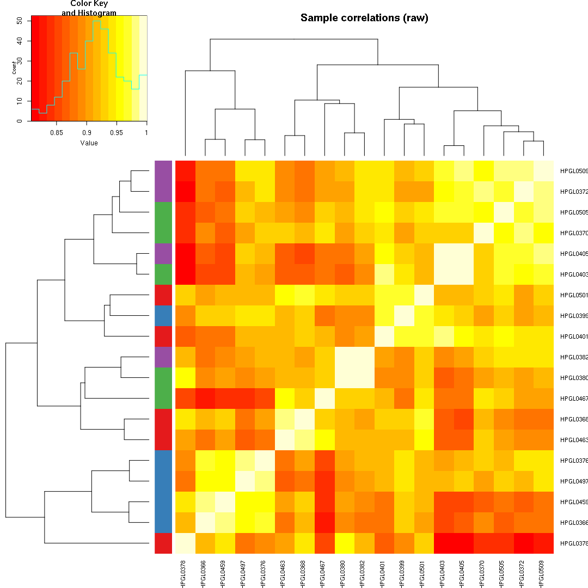
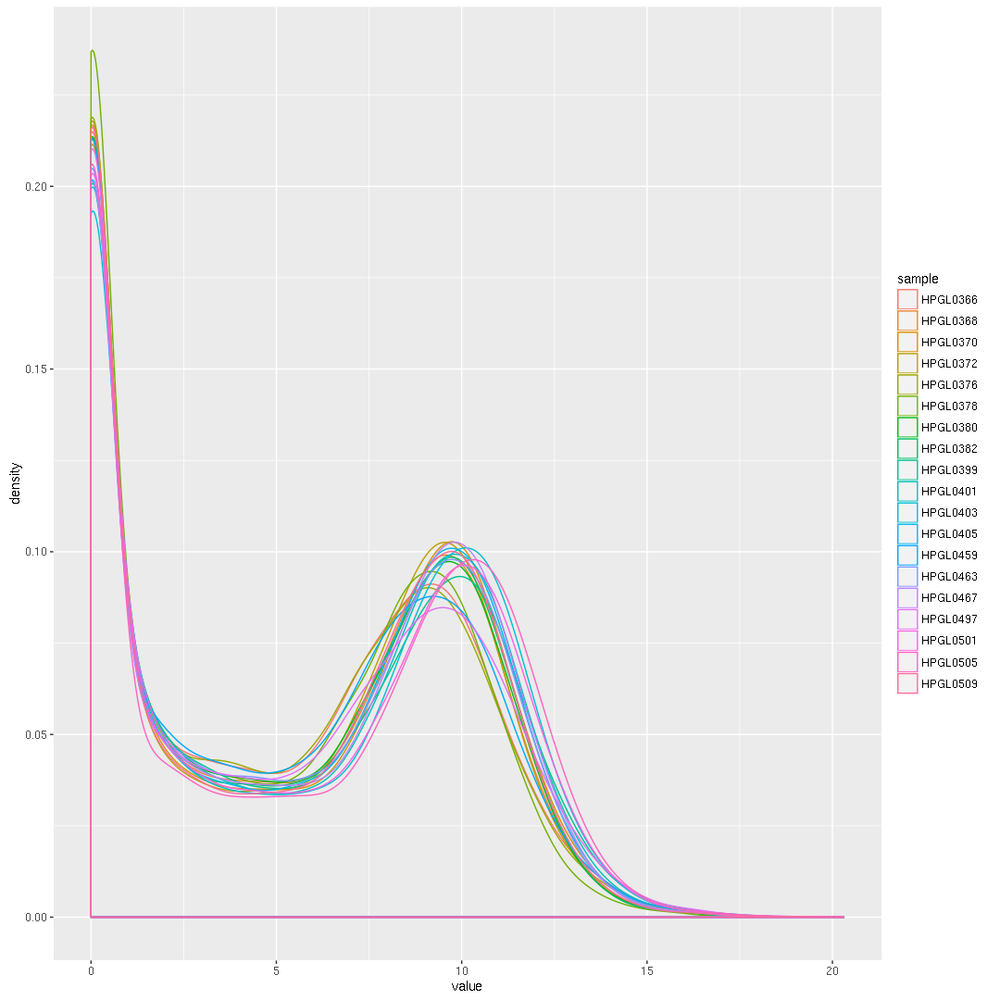
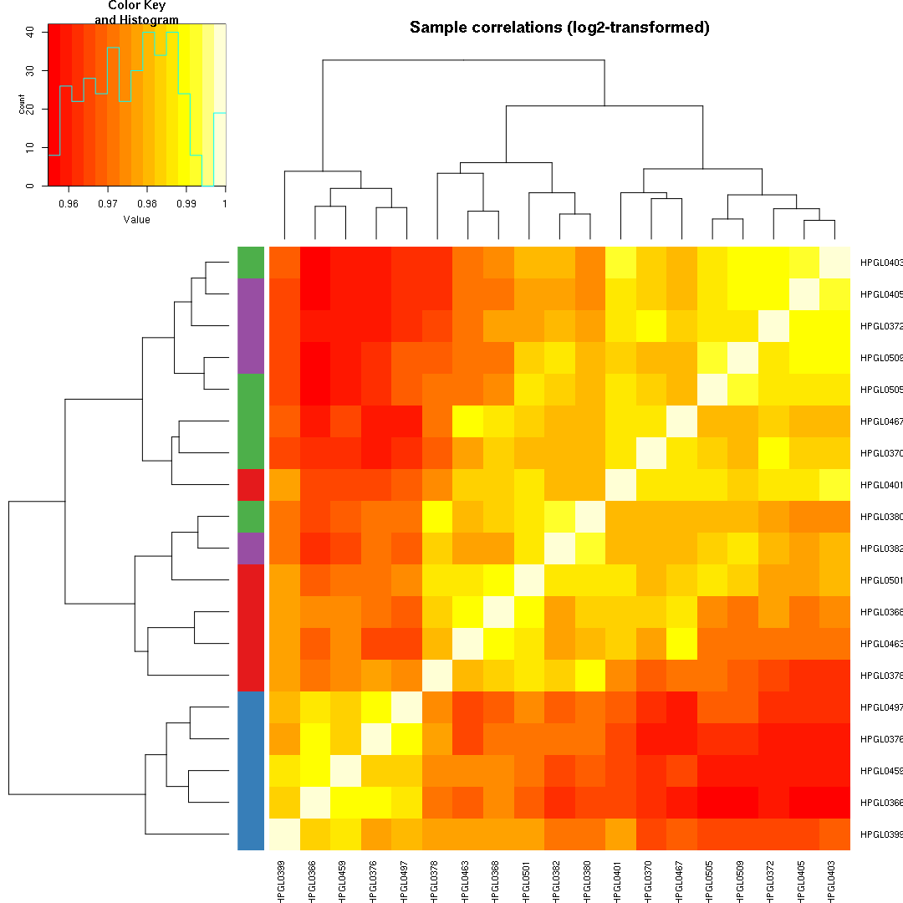
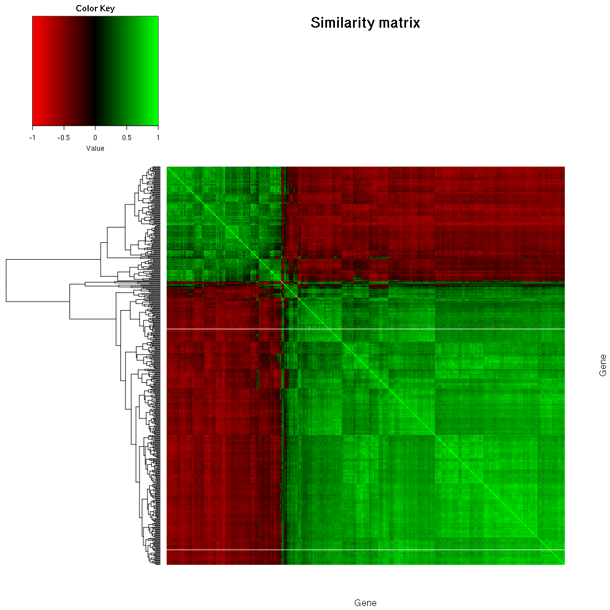
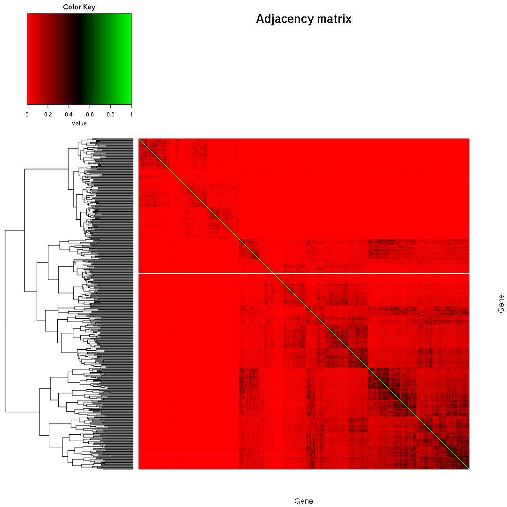

-   [Introduction](#introduction)
    -   [Overview](#overview)
    -   [Installation and Usage](#installation-and-usage)
    -   [Dataset](#dataset)
-   [Setup](#setup)
-   [Data Preparation](#data-preparation)
    -   [Sample check](#sample-check)
    -   [Low count filtering](#low-count-filtering)
    -   [Log2 transformation](#log2-transformation)
    -   [Remove non differentially-expressed genes](#remove-non-differentially-expressed-genes)
    -   [Co-expression network construction](#co-expression-network-construction)
    -   [Co-expression module detection](#co-expression-module-detection)
    -   [Exporting the network](#exporting-the-network)
-   [References](#references)
-   [Version Information](#version-information)

Introduction
============

### Overview

Here are the main steps we are going to cover in this tutorial:

1.  Data preparation
    -   low-count filtering
    -   log-transforming data

2.  Differential expression analysis
    -   filtering out non-differentially-expressed genes

3.  Co-expression network construction
4.  Detection of co-expression modules
5.  Exporting a network for external visualization

Things which are *not* covered in-depth in this tutorial, but warrant consideration:

1.  Sample quality assurance (FastQC, PCA plots, etc.)
    -   [FastQC homepage](http://www.bioinformatics.babraham.ac.uk/projects/fastqc/)
    -   [Bioconductor RNA-Seq workflow: Exploratory analysis and visualization](http://www.bioconductor.org/help/workflows/rnaseqGene/#exploratory-analysis-and-visualization)

2.  Batch adjustment (ComBat/sva/RUVSeq)
    -   [SVA tutorial](https://bioconductor.org/packages/release/bioc/vignettes/sva/inst/doc/sva.pdf)
    -   [The sva package for removing batch effects and other unwanted variation in high-throughput experiments (Leek, Johnson, Parker, Jaffe, and Storey, 2012)](http://bioinformatics.oxfordjournals.org/content/28/6/882.short)

3.  Normalization (Quantile normalization/TMM/etc.)
    -   [Evaluation of statistical methods for normalization and differential expression in mRNA-Seq experiments (Bullard, Purdom, Hansen, and Dudoit, 2010)](http://bmcbioinformatics.biomedcentral.com/articles/10.1186/1471-2105-11-94)
    -   [A comprehensive evaluation of normalization methods for Illumina high-throughput RNA sequencing data analysis (Dillies, Rau, Aubert, Hennequet-Antier, Jeanmougin, Servant, Keime, Marot, Castel, Estelle, Guernec, Jagla, Jouneau, Laloe, Gall, Schaeffer, Crom, Guedj, and Jaffrezic, 2012)](http://bib.oxfordjournals.org/content/14/6/671.short)

4.  A detailed discussion of the pros and cons of various approaches for differential expression analysis of RNA-Seq data.
    -   [Comparison of software packages for detecting differential expression in RNA-seq studies (Seyednasrollah, Laiho, and Elo, 2013)](http://bib.oxfordjournals.org/content/16/1/59.short)
    -   [A comparison of methods for differential expression analysis of RNA-seq data (Soneson and Delorenzi, 2013)](https://bmcbioinformatics.biomedcentral.com/articles/10.1186/1471-2105-14-91)

5.  Parameter Optimization

-   Short solution: try out a few different ways of preparing data, and measure network module enrichment each time.

1.  R programming.
    -   [Coursera - R programming](https://www.coursera.org/learn/r-programming)

### Installation and Usage

### Dataset

The dataset used for this tutorial comes from a dual transcriptome time-series infection study by `citet('10.1128/mBio.00027-16')`. A total of 19 samples are used, representing four time-points (4, 24, 48, and 72 hours) after infection of human donor macrophages by the kinetoplastid parasite [*Leishmania major*](https://en.wikipedia.org/wiki/Leishmania_major). A thorough description of steps used to map and count reads is provided in the original manuscript.

Setup
=====

First, let's load the libraries that we will be using for this analysis. These can all be installed using either `install.packages()`, or in some cases, `biocLite()`.

``` r
library('gplots')
```

    ## 
    ## Attaching package: 'gplots'

    ## The following object is masked from 'package:stats':
    ## 
    ##     lowess

``` r
library('ggplot2')
library('knitr')
library('limma')
library('reshape2')
library('RColorBrewer')
library('WGCNA')
```

    ## Loading required package: dynamicTreeCut

    ## Loading required package: fastcluster

    ## 
    ## Attaching package: 'fastcluster'

    ## The following object is masked from 'package:stats':
    ## 
    ##     hclust

    ## 

    ## ==========================================================================
    ## *
    ## *  Package WGCNA 1.51 loaded.
    ## *
    ## *    Important note: It appears that your system supports multi-threading,
    ## *    but it is not enabled within WGCNA in R. 
    ## *    To allow multi-threading within WGCNA with all available cores, use 
    ## *
    ## *          allowWGCNAThreads()
    ## *
    ## *    within R. Use disableWGCNAThreads() to disable threading if necessary.
    ## *    Alternatively, set the following environment variable on your system:
    ## *
    ## *          ALLOW_WGCNA_THREADS=<number_of_processors>
    ## *
    ## *    for example 
    ## *
    ## *          ALLOW_WGCNA_THREADS=12
    ## *
    ## *    To set the environment variable in linux bash shell, type 
    ## *
    ## *           export ALLOW_WGCNA_THREADS=12
    ## *
    ## *     before running R. Other operating systems or shells will
    ## *     have a similar command to achieve the same aim.
    ## *
    ## ==========================================================================

    ## 
    ## Attaching package: 'WGCNA'

    ## The following object is masked from 'package:stats':
    ## 
    ##     cor

``` r
# Make sure results are reproducible
set.seed(1)
```

Now, let's load the sample metadata file from the `data/` directory.

``` r
samples <- read.csv('../data/sample_metadata.csv')
kable(samples)
```

| sample\_id | condition | batch | patient |
|:-----------|:----------|:------|:--------|
| HPGL0366   | infLM4    | A     | H2      |
| HPGL0368   | infLM24   | A     | H2      |
| HPGL0370   | infLM48   | A     | H2      |
| HPGL0372   | infLM72   | A     | H2      |
| HPGL0376   | infLM4    | B     | H3      |
| HPGL0378   | infLM24   | B     | H3      |
| HPGL0380   | infLM48   | B     | H3      |
| HPGL0382   | infLM72   | B     | H3      |
| HPGL0399   | infLM4    | C     | H4      |
| HPGL0401   | infLM24   | C     | H4      |
| HPGL0403   | infLM48   | C     | H4      |
| HPGL0405   | infLM72   | C     | H4      |
| HPGL0459   | infLM4    | E     | H2      |
| HPGL0463   | infLM24   | E     | H2      |
| HPGL0467   | infLM48   | E     | H2      |
| HPGL0497   | infLM4    | F     | H3      |
| HPGL0501   | infLM24   | F     | H3      |
| HPGL0505   | infLM48   | F     | H3      |
| HPGL0509   | infLM72   | F     | H3      |

Next, we will load our RNA-Seq read counts.

``` r
raw_counts <- read.csv('../data/count_table.csv', row.names=1)
head(raw_counts)
```

    ##                 HPGL0366 HPGL0368 HPGL0370 HPGL0372 HPGL0376 HPGL0378
    ## ENSG00000000003        1        0        0        0        1        0
    ## ENSG00000000005        0        0        0        0        0        0
    ## ENSG00000000419      956      924     1082      677     1080      879
    ## ENSG00000000457       70      130      115      134       65      128
    ## ENSG00000000460       60      112      148      156       67       81
    ##                 HPGL0380 HPGL0382 HPGL0399 HPGL0401 HPGL0403 HPGL0405
    ## ENSG00000000003        1        0        0        0        1        0
    ## ENSG00000000005        0        0        0        0        0        0
    ## ENSG00000000419      986      991     1147     1015     1005      677
    ## ENSG00000000457      176      167      233      222      245      178
    ## ENSG00000000460      144      159      103      206      255      186
    ##                 HPGL0459 HPGL0463 HPGL0467 HPGL0497 HPGL0501 HPGL0505
    ## ENSG00000000003        1        0        1        0        0        0
    ## ENSG00000000005        0        0        0        0        0        0
    ## ENSG00000000419      957      809      784     1108     1087     1371
    ## ENSG00000000457       95      160      165      106      228      256
    ## ENSG00000000460       73      134      178       41      199      304
    ##                 HPGL0509
    ## ENSG00000000003        0
    ## ENSG00000000005        0
    ## ENSG00000000419      604
    ## ENSG00000000457      173
    ## ENSG00000000460      155
    ##  [ reached getOption("max.print") -- omitted 1 row ]

``` r
dim(raw_counts)
```

    ## [1] 20956    19

For gene annotations, we can use the Bioconductor `Homo.sapiens` OrganismDb package. This meta-package combines several Human-specific annotation packages, providing gene- and transcript-level details.

``` r
library('Homo.sapiens')
```

    ## Loading required package: AnnotationDbi

    ## Loading required package: stats4

    ## Loading required package: BiocGenerics

    ## Loading required package: parallel

    ## 
    ## Attaching package: 'BiocGenerics'

    ## The following objects are masked from 'package:parallel':
    ## 
    ##     clusterApply, clusterApplyLB, clusterCall, clusterEvalQ,
    ##     clusterExport, clusterMap, parApply, parCapply, parLapply,
    ##     parLapplyLB, parRapply, parSapply, parSapplyLB

    ## The following object is masked from 'package:limma':
    ## 
    ##     plotMA

    ## The following objects are masked from 'package:stats':
    ## 
    ##     IQR, mad, xtabs

    ## The following objects are masked from 'package:base':
    ## 
    ##     anyDuplicated, append, as.data.frame, cbind, colnames,
    ##     do.call, duplicated, eval, evalq, Filter, Find, get, grep,
    ##     grepl, intersect, is.unsorted, lapply, lengths, Map, mapply,
    ##     match, mget, order, paste, pmax, pmax.int, pmin, pmin.int,
    ##     Position, rank, rbind, Reduce, rownames, sapply, setdiff,
    ##     sort, table, tapply, union, unique, unsplit

    ## Loading required package: Biobase

    ## Welcome to Bioconductor
    ## 
    ##     Vignettes contain introductory material; view with
    ##     'browseVignettes()'. To cite Bioconductor, see
    ##     'citation("Biobase")', and for packages 'citation("pkgname")'.

    ## Loading required package: IRanges

    ## Loading required package: S4Vectors

    ## 
    ## Attaching package: 'S4Vectors'

    ## The following object is masked from 'package:gplots':
    ## 
    ##     space

    ## The following objects are masked from 'package:base':
    ## 
    ##     colMeans, colSums, expand.grid, rowMeans, rowSums

    ## Loading required package: OrganismDbi

    ## Loading required package: GenomicFeatures

    ## Loading required package: GenomeInfoDb

    ## Loading required package: GenomicRanges

    ## Loading required package: GO.db

    ## Loading required package: org.Hs.eg.db

    ## 

    ## Loading required package: TxDb.Hsapiens.UCSC.hg19.knownGene

OrganismDb packages can be queried in a manner similar to querying a database. You have to specify one or more gene identifiers ('keys'), along with the type of the identifier ('key type'), and one or more fields that you are interested in querying.

``` r
keytypes(Homo.sapiens)
```

    ##  [1] "ACCNUM"       "ALIAS"        "CDSID"        "CDSNAME"     
    ##  [5] "DEFINITION"   "ENSEMBL"      "ENSEMBLPROT"  "ENSEMBLTRANS"
    ##  [9] "ENTREZID"     "ENZYME"       "EVIDENCE"     "EVIDENCEALL" 
    ## [13] "EXONID"       "EXONNAME"     "GENEID"       "GENENAME"    
    ## [17] "GO"           "GOALL"        "GOID"         "IPI"         
    ## [21] "MAP"          "OMIM"         "ONTOLOGY"     "ONTOLOGYALL" 
    ## [25] "PATH"         "PFAM"         "PMID"         "PROSITE"     
    ## [29] "REFSEQ"       "SYMBOL"       "TERM"         "TXID"        
    ## [33] "TXNAME"       "UCSCKG"       "UNIGENE"      "UNIPROT"

``` r
columns(Homo.sapiens)
```

    ##  [1] "ACCNUM"       "ALIAS"        "CDSCHROM"     "CDSEND"      
    ##  [5] "CDSID"        "CDSNAME"      "CDSSTART"     "CDSSTRAND"   
    ##  [9] "DEFINITION"   "ENSEMBL"      "ENSEMBLPROT"  "ENSEMBLTRANS"
    ## [13] "ENTREZID"     "ENZYME"       "EVIDENCE"     "EVIDENCEALL" 
    ## [17] "EXONCHROM"    "EXONEND"      "EXONID"       "EXONNAME"    
    ## [21] "EXONRANK"     "EXONSTART"    "EXONSTRAND"   "GENEID"      
    ## [25] "GENENAME"     "GO"           "GOALL"        "GOID"        
    ## [29] "IPI"          "MAP"          "OMIM"         "ONTOLOGY"    
    ## [33] "ONTOLOGYALL"  "PATH"         "PFAM"         "PMID"        
    ## [37] "PROSITE"      "REFSEQ"       "SYMBOL"       "TERM"        
    ## [41] "TXCHROM"      "TXEND"        "TXID"         "TXNAME"      
    ## [45] "TXSTART"      "TXSTRAND"     "TXTYPE"       "UCSCKG"      
    ## [49] "UNIGENE"      "UNIPROT"

To query the package, you use the `select()` function, e.g.:

``` r
# Example query
gene_ids <- head(keys(Homo.sapiens, keytype='ENSEMBL'), 2)
select(Homo.sapiens, keytype='ENSEMBL', keys=gene_ids, 
       columns=c('ALIAS', 'TXCHROM', 'TXSTART', 'TXEND'))
```

    ## 'select()' returned 1:many mapping between keys and columns

    ##            ENSEMBL    ALIAS TXCHROM  TXSTART    TXEND
    ## 1  ENSG00000121410      A1B   chr19 58858172 58864865
    ## 2  ENSG00000121410      A1B   chr19 58859832 58874214
    ## 3  ENSG00000121410      ABG   chr19 58858172 58864865
    ## 4  ENSG00000121410      ABG   chr19 58859832 58874214
    ## 5  ENSG00000121410      GAB   chr19 58858172 58864865
    ## 6  ENSG00000121410      GAB   chr19 58859832 58874214
    ## 7  ENSG00000121410 HYST2477   chr19 58858172 58864865
    ## 8  ENSG00000121410 HYST2477   chr19 58859832 58874214
    ## 9  ENSG00000121410     A1BG   chr19 58858172 58864865
    ## 10 ENSG00000121410     A1BG   chr19 58859832 58874214
    ## 11 ENSG00000175899     A2MD   chr12  9220304  9268558
    ## 12 ENSG00000175899   CPAMD5   chr12  9220304  9268558
    ## 13 ENSG00000175899   FWP007   chr12  9220304  9268558
    ## 14 ENSG00000175899   S863-7   chr12  9220304  9268558
    ## 15 ENSG00000175899      A2M   chr12  9220304  9268558

Data Preparation
================

### Sample check

First, it is always wise to check the quality of your samples before continuing with an analysis like this. There are many such checks that one can (and should) perform, starting at the level of read quality (e.g. FastQC).

Here, we will just do a quick check using a sample-correlation heatmap.

``` r
# add a colorbar along the heatmap with sample condition
num_conditions <- nlevels(samples$condition)
pal <- colorRampPalette(brewer.pal(num_conditions, "Set1"))(num_conditions)
cond_colors <- pal[as.integer(samples$condition)]

heatmap.2(cor(raw_counts), RowSideColors=cond_colors,
          trace='none', main='Sample correlations (raw)')
```



### Low count filtering

Now that we are satisfied with the quality of our samples, we will want to filter our data to keep only the genes which will be informative during differential expression analysis and network construction.

``` r
# Remove all rows with less than n counts across all samples, where n=#samples
low_count_mask <- rowSums(raw_counts) < ncol(raw_counts)

sprintf("Removing %d low-count genes (%d remaining).", sum(low_count_mask), 
        sum(!low_count_mask))
```

    ## [1] "Removing 6154 low-count genes (14802 remaining)."

### Log2 transformation

Most of the methods developed for co-expression network analysis and network inference were written for use with microarray data, including WGCNA!

Attempting to apply a method such as this to discrete-count RNA-Seq data will not work out well.

There are a number of methods for working around this, in effect, making RNA-Seq data "look" more like microarray data, but the simplest thing is just to *log* the data. This will transform our discrete, over-dispersed counts to a more Poisson-like continuous distribution.

``` r
log_counts <- log2(raw_counts + 1)
```

Let's see how things look after logging the data.

``` r
x = melt(as.matrix(log_counts))

colnames(x) = c('gene_id', 'sample', 'value')
ggplot(x, aes(x=value, color=sample)) + geom_density()
```



``` r
heatmap.2(cor(log_counts), RowSideColors=cond_colors,
          trace='none', main='Sample correlations (log2-transformed)')
```



As you can see, after the low-count filtering and log-transformation, the samples within each condition are starting to behave better.

### Remove non differentially-expressed genes

Next, we will perform a series of differential expression contrasts, and use the results to further filter out genes for which there is not a significant amount of variance.

If you were *just* interested in performing differential expression analysis, this may not be the most appropriate approach. In this case, you may want to consider additional steps such as [quantile normalization](https://en.wikipedia.org/wiki/Quantile_normalization) and/or mean-variance adjustment with [voom](http://link.springer.com/article/10.1186/gb-2014-15-2-r29).

``` r
# first, let's remove any genes with _zero_ variance since these are not
# going to help us, and may cause problems with some of the models
log_counts <- log_counts[apply(log_counts, 1, var) > 0,]

# create design matrix for differential expression analysis;
# if you wanted to account for batch here, you could simply include a batch
# term in the linear model at this step, e.g.:
# mod <- model.matrix(~0+samples$condition+samples$batch)
mod <- model.matrix(~0+samples$condition)

# make model terms easier to work with
colnames(mod) <- levels(samples$condition)

fit <- lmFit(log_counts, design=mod)

# generate a list of all possible pairwise contrasts
condition_pairs <- t(combn(levels(samples$condition), 2))                                                                                                                               
                                                                                                                                                                             
comparisons <- list()                                                                                                                                          
for (i in 1:nrow(condition_pairs)) {                                                                                                                                     
    comparisons[[i]] <- as.character(condition_pairs[i,])                                                                                                      
}    

# vector to store de genes
sig_genes <- c()

# iterate over the contrasts, and perform a differential expression test for
# each pair
for (conds in comparisons) {
    # generate string contrast formula, "infLM24 - infLM4"
    contrast_formula <- paste(conds, collapse=' - ')

    contrast_mat <- makeContrasts(contrasts=contrast_formula, levels=mod)
    contrast_fit <- contrasts.fit(fit, contrast_mat)
    eb <- eBayes(contrast_fit)

    # Grab highly ranked genes; this is a pretty stringent p-value cutoff, but
    # it serves to limit the total number of genes we will use for this
    # tutorial
    sig_genes <- union(sig_genes, 
                       rownames(topTable(eb, number=Inf, p.value=0.005)))
}

# Filter out genes which were not differentially expressed for any contrast
log_counts <- log_counts[rownames(log_counts) %in% sig_genes,]
```

### Co-expression network construction

#### Construct similarity matrix

Now, we are ready to start constructing our co-expression network. The first step is to generate a correlation, or more generally, a similarity matrix.

For this, we could use any similarity metric: Pearson correlation, Biweight mid-correlation, mutual information, etc.

Here, we will use a metric that I have created which combines some of the benefits from both Pearson correlation and Euclidean Distance.

For a data matrix *X* with observations as columns (samples) and features for rows (genes), the feature-feature similarity matrix *S* is computed as:

$$
S = sign(cor(X)) \\times \\frac{|cor(X)| + (1 - \\frac{log(dist(X) + 1)}{max(log(dist(X) + 1))})}{2}
$$

Where the `cor` returns the Pearson correlation matrix for the input matrix, and the `dist` function returns the Euclidean distance matrix for the input matrix.

The LHS of the equation is simply the sign of the correlation function, which serves to preserve the sign of the interaction. The RHS combines the Pearson correlation and the log inverse Euclidean distance with equal weights.

The result is a number in the range \[ − 1, 1\], where values close to −1 indicate a strong negative correlation and values close to 1 indicate a strong positive corelation.

While the Pearson correlation and Euclidean distance each contribute equally in the above equation, one could also assign tuning parameters to each of the metrics to allow for unequal contributions, e.g.:

$$
S = sign(cor(X)) \\times (\\alpha |cor(X)| + \\beta (1 - \\frac{log(dist(X) + 1)}{max(log(dist(X) + 1))}))
$$

Where *α* and *β* each range from \[0, 1\] and sum to 1.

``` r
#'
#' Similarity measure which combines elements from Pearson correlation and
#' Euclidean distance.
#' 
cordist <- function(dat) {
    cor_matrix  <- cor(t(dat))

    dist_matrix <- as.matrix(dist(dat, diag=TRUE, upper=TRUE))
    dist_matrix <- log1p(dist_matrix)
    dist_matrix <- 1 - (dist_matrix / max(dist_matrix))

    sign(cor_matrix) * ((abs(cor_matrix) + dist_matrix)/ 2)
}
```

``` r
sim_matrix <- cordist(log_counts)
```

Let's see what our similarity matrix looks like at this point. Because the `heatmap.2` function (which includes a biclustering step) can be pretty slow, we will use a sub-sample of our data -- for visualization purposes this is fine.

``` r
heatmap_indices <- sample(nrow(sim_matrix), 500)

heatmap.2(t(sim_matrix[heatmap_indices, heatmap_indices]),
            col=redgreen(75),
            labRow=NA, labCol=NA, 
            trace='none', dendrogram='row',
            xlab='Gene', ylab='Gene',
            main='Similarity matrix',
            density.info='none', revC=TRUE)
```



#### Construct adjacency matrix

Next, we will convert similarity matrix to an adjacency matrix.

For this, we will use the power transformation, as suggested by Zhang and Horvath (2005).

This will help us to reduce the number of spurious correlations in the data.

Additionally, in order to separate clusters of genes which have a strong positive correlation from those with a strong negative correlation, we will first shift the data from the range \[-1,1\] to \[0,1\].

The combined transformation is:

$$
a\_{ij} = \\left(\\frac{1}{2} (1 + s\_{ij})\\right)^\\gamma
$$

Some additional reading regarding the use of power transformation:

1.  [http://labs.genetics.ucla.edu/horvath/CoexpressionNetwork/Rpackages/WGCNA/faq.html](WGCNA%20FAQ) (E.g. item \#5)
2.  [https://support.bioconductor.org/p/66101/\#66195](Bioconductor%20Support%20-%20Question:%20Theoretical%20WGCNA%20Question)

``` r
# Construct adjacency matrix
adj_matrix <- adjacency.fromSimilarity(sim_matrix, power=12, type='signed')

# Delete similarity matrix to free up memory
rm(sim_matrix)
gc()
```

    ##            used  (Mb) gc trigger  (Mb) max used  (Mb)
    ## Ncells  4357989 232.8    6861544 366.5  6861544 366.5
    ## Vcells 15641434 119.4   69040500 526.8 77127451 588.5

``` r
# Convert to matrix
gene_ids <- rownames(adj_matrix)

adj_matrix <- matrix(adj_matrix, nrow=nrow(adj_matrix))
rownames(adj_matrix) <- gene_ids
colnames(adj_matrix) <- gene_ids
```

Same plot as before, but now for our adjacency matrix:

``` r
heatmap.2(t(adj_matrix[heatmap_indices, heatmap_indices]),
            col=redgreen(75),
            labRow=NA, labCol=NA, 
            trace='none', dendrogram='row',
            xlab='Gene', ylab='Gene',
            main='Adjacency matrix',
            density.info='none', revC=TRUE)
```



### Co-expression module detection

At this point, we already have our co-expression network. We could simply threshold the adjacency matrix, export the remaining edges, and load it into Cytoscape for visualization.

Before we do that, however, let's first try and detect co-expression modules in the network.

For this, we will use hierarchical clustering following by branch-cutting.

``` r
# Cluster gene expression profiles; the flashClust function from
# the authors of WGCNA is another options for larger datasets.
# For input, we use the reciprocal of the adjacency matrix; hierarchical
# clustering works by comparing the _distance_ between objects instead of the
# _similarity_.
gene_tree <- hclust(as.dist(1 - adj_matrix), method="average")

# we will use the cuttreeDynamicTree method to break apart the hc dendrogram
# into separate modules
module_labels <- cutreeDynamicTree(dendro=gene_tree, minModuleSize=15,
                                   deepSplit=TRUE)

# assign a color to each module for easier visualization and referencing
module_colors <- labels2colors(module_labels)
```

### Exporting the network

Another helper function for exporting our network to the metadata-rich GraphML format...

``` r
#' Converts an adjaceny matrix along with some optional vertex and edge
#'  information to a GraphML graph and saves it to disk.
#'
#' @param adj_mat An n-by-n weighted or unweighted adjacency matrix normalized
#' to contain values between 0 and 1.
#' @param filename Name of file to save output to. If file already exists it
#' will be overwritten. (default: network.graphml)
#' @param weighted Whether or not the adjacency matrix should be treated as a 
#' weighted graph. (default: TRUE)
#' @param threshold For weighted networks, if a threshold value between 0 and 
#' 1 is specified, all edges with weights below that value with be dropped from
#'   the graph. (default: 0.5)
#' @param max_edge_ratio The maximum number of edges per node in the network to
#' allow. If the number of edges that would remain for the specified threshold
#' exceeds this value, the threshold will be raised to reduce the number of
#' edges remaining. (default: 3)
#' @param nodeAttr A vector with length equal to the number of vertices in the 
#' network, where the ith entry in the vector corresponds to some numeric or 
#' string annotation that should be associated with the ith node in the 
#' adjacency matrix. (default: NULL)
#' @param nodeAttrDataFrame A data frame containing one or more columns 
#' associated with the vertices in the graph.  The ith row of the dataframe 
#' should correspond to the ith entry in the adjacency matrix. (default: NULL)
#' @param edgeAttributes Extra attributes to associate with the graph edges,
#' formatted as a list of matrices of the same dimension and names as the
#' adjacency matrix.
#'
#' Examples
#' --------
#' export_network_to_graphml(adj_mat, filename='~/network.graphml',
#'                           threshold=0.3, nodeAttrDataFrame=df)
#'
#' See Also
#' --------
#' 1. http://www.inside-r.org/packages/cran/WGCNA/docs/exportNetworkToCytoscape
#' 2. http://graphml.graphdrawing.org/
#'
#' Returns
#' -------
#' An igraph graph object representing the exported graph.
export_network_to_graphml <- function (adj_mat, filename=NULL, weighted=TRUE,
                                       threshold=0.5, max_edge_ratio=3,
                                       nodeAttr=NULL, nodeAttrDataFrame=NULL,
                                       edgeAttributes=NULL, verbose=FALSE) {
    library('igraph')

    # Determine filename to use
    if (is.null(filename)) {
        filename='network.graphml'
    }

    # TODO 2015/04/09
    # Add option to rescale correlations for each module before applying
    # threshold (this is simpler than the previous approach of trying to
    # determine a different threshold for each module)
    #
    # Still, modules with very low correlations should be given somewhat
    # less priority than those with very high correlations.

    #module_colors <- unique(nodeAttrDataFrame$color)
    #module_genes <- which(nodeAttrDataFrame$color == color)
    #module_adjmat <- adj_mat[module_genes,]
    #num_genes <- length(module_genes)

    # Adjust threshold if needed to limit remaining edges
    max_edges <- max_edge_ratio * nrow(adj_mat)

    edge_to_total_ratio <- max_edges / length(adj_mat)
    edge_limit_cutoff <- as.numeric(quantile(abs(adj_mat), 1 - edge_to_total_ratio))

    # Also choose a minimum threshold to make sure that at least some edges
    # are left
    min_threshold <- as.numeric(quantile(abs(adj_mat), 0.9999))

    threshold <- min(min_threshold, max(threshold, edge_limit_cutoff))

    # Remove edges with weights lower than the cutoff
    adj_mat[abs(adj_mat) < threshold] <- 0

    # Drop any genes with no edges (TODO: Make optional)
    orphaned <- (colSums(adj_mat) == 0)
    adj_mat <- adj_mat[!orphaned, !orphaned]

    # Also remove annotation entries
    if (!is.null(nodeAttr)) {
        nodeAttr <- nodeAttr[!orphaned]
    }
    if (!is.null(nodeAttrDataFrame)) {
        nodeAttrDataFrame <- nodeAttrDataFrame[!orphaned,]
    }

    # Keep track of non-positive edges and rescale to range 0,1
    is_zero     <- adj_mat == 0
    is_negative <- adj_mat < 0

    adj_mat <- (abs(adj_mat) - threshold) / (max(adj_mat) - threshold)
    adj_mat[is_zero] <- 0
    adj_mat[is_negative] <- -adj_mat[is_negative]

    if (verbose) {
        message(sprintf("Outputting matrix with %d nodes and %d edges", 
                        nrow(adj_mat), sum(adj_mat > 0)))
    }

    # Create a new graph and add vertices
    # Weighted graph
    if (weighted) {
        g <- graph.adjacency(adj_mat, mode='undirected', weighted=TRUE, diag=FALSE)
    } else {
        adj_mat[adj_mat != 0] <- 1
        g <- graph.adjacency(adj_mat, mode='undirected', diag=FALSE)
    }

    # Add single node annotation from vector
    if (!is.null(nodeAttr)) {
        g <- set.vertex.attribute(g, "attr", value=nodeAttr)
    }

    # Add node one or more node annotations from a data frame
    if (!is.null(nodeAttrDataFrame)) {
        for (colname in colnames(nodeAttrDataFrame)) {
            g <- set.vertex.attribute(g, colname, value=nodeAttrDataFrame[,colname])
        }
    }

    edge_correlation_negative <- c()

    # neg_correlations[edge_list]
    edge_list <- get.edgelist(g)

    for (i in 1:nrow(edge_list)) {
        from <- edge_list[i, 1]    
        to   <- edge_list[i, 2]    
    }
    
    # Save graph to a file
    write.graph(g, filename, format='graphml')

    # return igraph
    return(g)
}
```

``` r
# use OrganismDb to retrieve gene annotations
gene_info <- select(Homo.sapiens, keytype='ENSEMBL', keys=rownames(log_counts),
                    columns=c('TXCHROM', 'TXSTRAND', 'GENENAME'))
```

    ## 'select()' returned 1:many mapping between keys and columns

``` r
colnames(gene_info) <- c('gene_id', 'description', 'chr', 'strand')

# for now, just grab the description for the first transcript
gene_info <- gene_info[!duplicated(gene_info$gene_id),]

gene_info <- cbind(gene_info, module=module_colors)

# Include RGB versions of module colors for better assignment in Cytoscape
gene_info$color_rgb <- col2hex(gene_info$module)

# first, it's a good idea to check the distribution of edges weights in our
# correlation matrix. This will help us choose a reasonable cutoff for
# exporting the network.
g <- export_network_to_graphml(adj_matrix, filename='~/network.graphml',
                               threshold=0.4, nodeAttrDataFrame=gene_info)
```

    ## 
    ## Attaching package: 'igraph'

    ## The following object is masked from 'package:GenomicRanges':
    ## 
    ##     union

    ## The following objects are masked from 'package:IRanges':
    ## 
    ##     simplify, union

    ## The following objects are masked from 'package:S4Vectors':
    ## 
    ##     compare, union

    ## The following objects are masked from 'package:BiocGenerics':
    ## 
    ##     normalize, union

    ## The following objects are masked from 'package:stats':
    ## 
    ##     decompose, spectrum

    ## The following object is masked from 'package:base':
    ## 
    ##     union

References
==========

\[1\] J. H. Bullard, E. Purdom, K. D. Hansen, et al. "Evaluation of statistical methods for normalization and differential expression in mRNA-Seq experiments". In: *BMC Bioinformatics* 11.1 (2010), p. 94. DOI: 10.1186/1471-2105-11-94. &lt;URL: <http://dx.doi.org/10.1186/1471-2105-11-94>&gt;.

\[2\] M. Dillies, A. Rau, J. Aubert, et al. "A comprehensive evaluation of normalization methods for Illumina high-throughput RNA sequencing data analysis". In: *Briefings in Bioinformatics* 14.6 (Sep. 2012), pp. 671-683. DOI: 10.1093/bib/bbs046. &lt;URL: <http://dx.doi.org/10.1093/bib/bbs046>&gt;.

\[3\] J. T. Leek, W. E. Johnson, H. S. Parker, et al. "The sva package for removing batch effects and other unwanted variation in high-throughput experiments". In: *Bioinformatics* 28.6 (Jan. 2012), pp. 882-883. DOI: 10.1093/bioinformatics/bts034. &lt;URL: <http://dx.doi.org/10.1093/bioinformatics/bts034>&gt;.

\[4\] F. Seyednasrollah, A. Laiho and L. L. Elo. "Comparison of software packages for detecting differential expression in RNA-seq studies". In: *Briefings in Bioinformatics* 16.1 (Dec. 2013), pp. 59-70. DOI: 10.1093/bib/bbt086. &lt;URL: <http://dx.doi.org/10.1093/bib/bbt086>&gt;.

\[5\] C. Soneson and M. Delorenzi. "A comparison of methods for differential expression analysis of RNA-seq data". In: *BMC Bioinformatics* 14.1 (2013), p. 91. DOI: 10.1186/1471-2105-14-91. &lt;URL: <http://dx.doi.org/10.1186/1471-2105-14-91>&gt;.

Version Information
===================

``` r
sessionInfo()
```

    ## R version 3.3.0 (2016-05-03)
    ## Platform: x86_64-pc-linux-gnu (64-bit)
    ## Running under: Arch Linux
    ## 
    ## locale:
    ##  [1] LC_CTYPE=en_US.UTF-8       LC_NUMERIC=C              
    ##  [3] LC_TIME=en_US.UTF-8        LC_COLLATE=en_US.UTF-8    
    ##  [5] LC_MONETARY=en_US.UTF-8    LC_MESSAGES=en_US.UTF-8   
    ##  [7] LC_PAPER=en_US.UTF-8       LC_NAME=C                 
    ##  [9] LC_ADDRESS=C               LC_TELEPHONE=C            
    ## [11] LC_MEASUREMENT=en_US.UTF-8 LC_IDENTIFICATION=C       
    ## 
    ## attached base packages:
    ## [1] parallel  stats4    stats     graphics  grDevices utils     datasets 
    ## [8] methods   base     
    ## 
    ## other attached packages:
    ##  [1] igraph_1.0.1                           
    ##  [2] Homo.sapiens_1.3.1                     
    ##  [3] TxDb.Hsapiens.UCSC.hg19.knownGene_3.2.2
    ##  [4] org.Hs.eg.db_3.3.0                     
    ##  [5] GO.db_3.3.0                            
    ##  [6] OrganismDbi_1.14.1                     
    ##  [7] GenomicFeatures_1.24.2                 
    ##  [8] GenomicRanges_1.24.1                   
    ##  [9] GenomeInfoDb_1.8.1                     
    ## [10] AnnotationDbi_1.34.3                   
    ## [11] IRanges_2.6.0                          
    ## [12] S4Vectors_0.10.1                       
    ## [13] Biobase_2.32.0                         
    ## [14] BiocGenerics_0.18.0                    
    ## [15] WGCNA_1.51                             
    ## [16] fastcluster_1.1.20                     
    ## [17] dynamicTreeCut_1.63-1                  
    ## [18] RColorBrewer_1.1-2                     
    ## [19] reshape2_1.4.1                         
    ## [20] limma_3.28.5                           
    ## [21] ggplot2_2.1.0                          
    ## [22] gplots_3.0.1                           
    ## [23] knitcitations_1.0.7                    
    ## [24] knitr_1.13                             
    ## [25] rmarkdown_0.9.6                        
    ## [26] setwidth_1.0-4                         
    ## [27] colorout_1.1-1                         
    ## 
    ## loaded via a namespace (and not attached):
    ##  [1] httr_1.1.0                 splines_3.3.0             
    ##  [3] foreach_1.4.3              gtools_3.5.0              
    ##  [5] Formula_1.2-1              highr_0.6                 
    ##  [7] latticeExtra_0.6-28        RBGL_1.48.1               
    ##  [9] Rsamtools_1.24.0           yaml_2.1.13               
    ## [11] impute_1.46.0              RSQLite_1.0.0             
    ## [13] lattice_0.20-33            chron_2.3-47              
    ## [15] digest_0.6.9               XVector_0.12.0            
    ## [17] RefManageR_0.10.13         colorspace_1.2-6          
    ## [19] htmltools_0.3.5            preprocessCore_1.34.0     
    ## [21] Matrix_1.2-6               plyr_1.8.3                
    ## [23] XML_3.98-1.4               bibtex_0.4.0              
    ## [25] biomaRt_2.28.0             zlibbioc_1.18.0           
    ## [27] scales_0.4.0               gdata_2.17.0              
    ## [29] BiocParallel_1.6.2         SummarizedExperiment_1.2.2
    ## [31] nnet_7.3-12                survival_2.39-4           
    ## [33] RJSONIO_1.3-0              magrittr_1.5              
    ## [35] evaluate_0.9               doParallel_1.0.10         
    ## [37] foreign_0.8-66             graph_1.50.0              
    ## [39] BiocInstaller_1.22.2       tools_3.3.0               
    ## [41] data.table_1.9.6           formatR_1.4               
    ## [43] matrixStats_0.50.2         stringr_1.0.0             
    ## [45] munsell_0.4.3              cluster_2.0.4             
    ## [47] Biostrings_2.40.1          caTools_1.17.1            
    ## [49] grid_3.3.0                 RCurl_1.95-4.8            
    ## [51] iterators_1.0.8            labeling_0.3              
    ## [53] bitops_1.0-6               gtable_0.2.0              
    ## [55] codetools_0.2-14           DBI_0.4-1                 
    ## [57] R6_2.1.2                   GenomicAlignments_1.8.1   
    ## [59] gridExtra_2.2.1            lubridate_1.5.6           
    ## [61] rtracklayer_1.32.0         Hmisc_3.17-4              
    ## [63] KernSmooth_2.23-15         stringi_1.1.1             
    ## [65] Rcpp_0.12.5                rpart_4.1-10              
    ## [67] acepack_1.3-3.3
